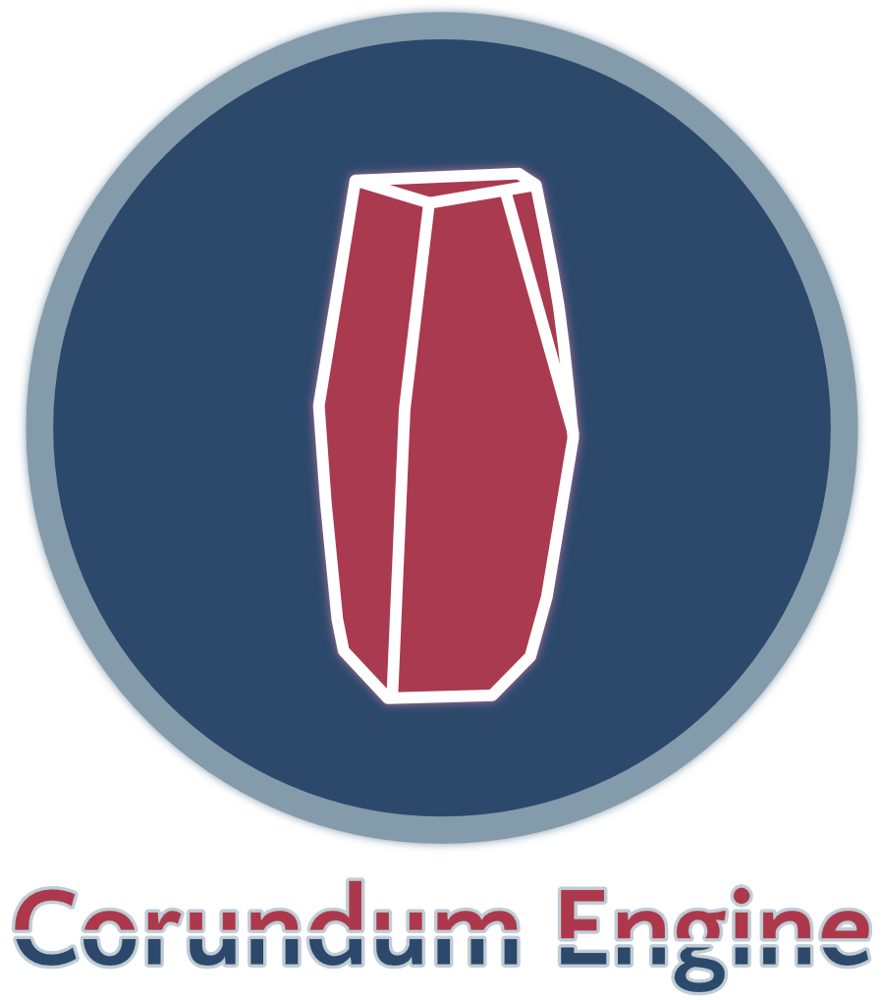

  

Corundum is a C++ game engine for making 2D games.

## Getting Started

Code and build instructions to follow...

## Links

-   [SDL](https://www.libsdl.org) - Simple DirectMedia Layer
-   [Lua](https://www.lua.org) - Lua scripting language
-   [CMake](https://cmake.org) - Cross-platform build tool
-   [Catch2](https://github.com/catchorg/Catch2) - Unit test framework

## License

Licensed under the Mozilla Public License 2.0, see [LICENSE](https://github.com/gentlelionstudios/CorundumEngine/blob/master/LICENSE) for details.
